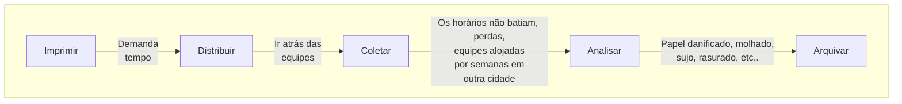
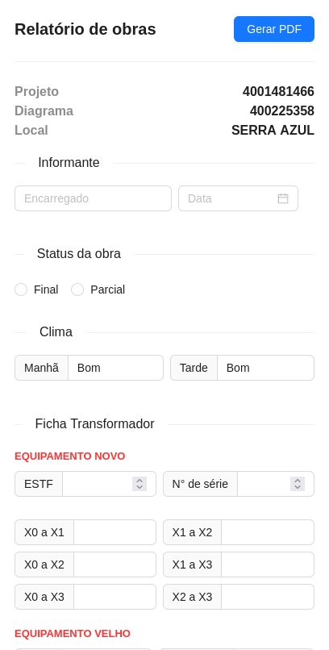
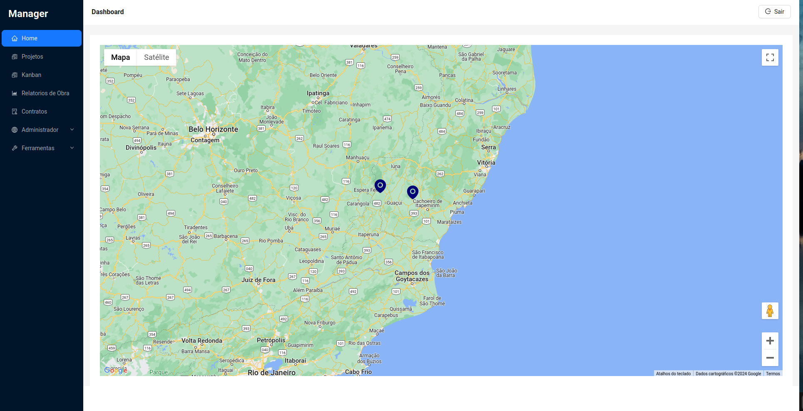
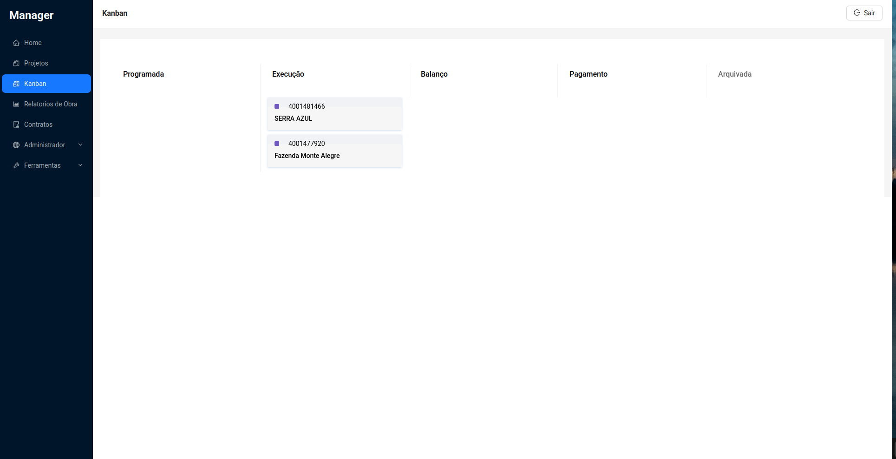
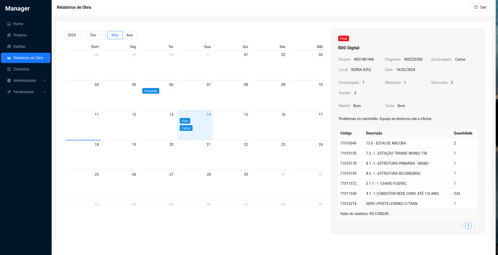

## Manager

### Eu só não aguentava mais aquela papelada, suja de terra, molhada, rasgada ou rasurada, isso quando entregavam.

Esta aplicação foi desenvolvida para solucionar problemas relacionados à documentação e ao uso excessivo de papel.

Atualmente, está dividida em duas soluções: Manager e [RDO Digital.](https://github.com/eliasamaral/rdo-digital)

O Manager possibilita a visualização de dados coletados pelo RDO Digital, além de ser responsável por cadastrar os formulários exibidos no RDO.

Durante o desenvolvimento, novas funcionalidades foram criadas, como o cadastro de uma carteira de obra e a visualização em mapas utilizando a API do Google Maps.

Também foi implementado um Kanban para visualização e controle dos status das obras.

#### O problema 💀

Como vê, muitos problemas naturais de que ainda têm processos utilizando papel.

#### A solução 

Desenvolvimento do RDO Digital, um formulário digital que gera PDFs para serem enviados ao escritório.

O Manager entra como um CRUD, interface um backoff para o cadastro das obras e visualizar os relatórios gerados além dos PDFs.

### Crecimento

Hoje a aplicação cresceu com novas funcionalidades: uma tela de login, Kanban e a última funcionalidade é um mapa para visualização do local das obras.

Utilizando uma API feita em GraphQL com um banco MongoDB, ainda tenho grandes desafios. Implementação de informações em tempo real, controle de permissões entre outras funcionalidades que já estão anotadas em algum papel por aqui.

